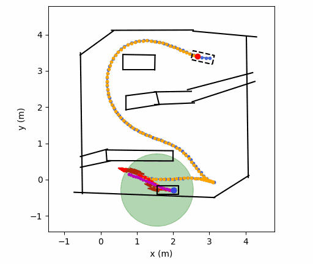
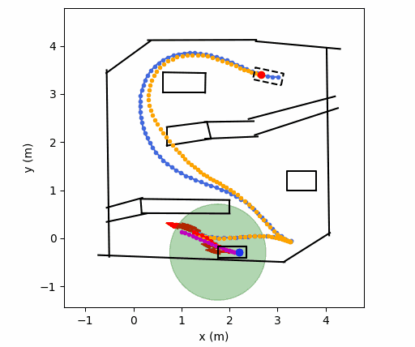
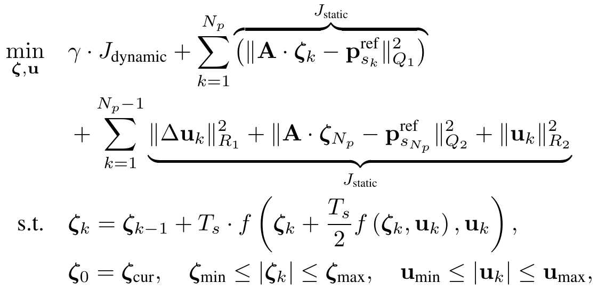

# MPC Planner for Dataset Generation

Deploy and visualize the trajectory planner in paper "[Rapid and Safe Trajectory Planning over Diverse Scenes through Diffusion Composition](https://arxiv.org/abs/2507.04384)".

Do you find that tuning dynamic collision-avoidance parameters is often time-consuming and tedious? Try our work on diffusion composition — it enables test-time decision-making to produce safe behaviors, such as accelerating to bypass obstacles or decelerating to avoid them, thereby enabling safe trajectory planning for diverse scenarios without the need for extra parameter tuning!

<div style="display: flex; justify-content: flex-start;">
	
	
</div>
<br>

This diffusion composition approach guarantees safe, collision-free trajectory planning in unseen scenes for safety.

<div style="display: flex; justify-content: flex-start;">
	
</div>
<br>

# 🪄 Quickstart

Start by cloning this repository to the host:

```bash
git clone https://github.com/zhouhengli/rstp-mpc-planner.git
```

## 📂 Folder Structure

```
.
├── assets
├── collision_check   # For posterior checking of collisions in rstp-mpc trajectories
├── config
├── dataset           # Reference trajectories generated using the ritp method
├── LICENSE
├── local_planner     # Core implementation of the MPC formulation
├── map
├── media
├── README.md
├── requirements.txt
└── scripts           # Entry point of the code
```

The [ritp](https://github.com/zhouhengli/ritp) method is a path-velocity decomposition planning approach characterized by exceptionally fast computation, achieving runtimes as low as 10 ms on a standard desktop computer. In particular, the ItCA method, used to smooth discrete path points, demonstrates excellent performance in ensuring feasibility.

## 🧮 Mathematical Formulas

The improved Euler method is used to discretize the kinematic model $f(\zeta),$ where $\zeta_0$ represents the current state of the vehicle. Then the optimization problem for the MPC planner across diverse scenes is expressed as follows:

<div style="display: flex; justify-content: center; align-items: center;">
	
</div>

where $\mathbf{A} = [1,\, 1,\, 1,\, 0]^{\top},$ and $N_p$ denotes the prediction horizon. $\zeta_{\text{cur}}$ is the current vehicle state. In dynamic scenes, $\gamma = 1$; otherwise, $\gamma = 0$.

## 🛠️ Configure

**[1/3] Create and Activate a Virtual Environment:** First, create a virtual environment using `conda` with Python 3.8, then activate it:

```bash
conda create -n rstp-mpc python=3.8
conda activate rstp-mpc
```

**[2/3] Install Dependencies:** Next, install all required dependencies using `pip` from the `requirements.txt` file:

```bash
pip install -r requirements.txt
```

**[3/3] Run the Script:** Finally, you can run the script to initiate the process:

```bash
python scripts/mpc_planner.py
```

This will start the main functionality of the repository.

## 🤗 Acknowledgments

- [Vehicle_Motion_Planning_with_Obstacles_Avoidance_using_MPC](https://github.com/tg623623nana/Vehicle_Motion_Planning_with_Obstacles_Avoidance_using_MPC)
- [AutomatedValetParking](https://github.com/wenqing-2021/AutomatedValetParking)

Please contact [Zhouheng Li](https://zhouhengli.github.io/) if you have any questions or suggestions.

## Citations

If you find this work useful, please consider starring this repository and citing the paper as follows:

```
@article{mao2025rapid, 
	title={Rapid and Safe Trajectory Planning over Diverse Scenes through Diffusion Composition}, 
	author={Mao, Wule and Li, Zhouheng and Luo, Yunhao and Du, Yilun and Xie, Lei}, 
	journal={arXiv preprint arXiv:2507.04384}, 
	year={2025} 
}
```
